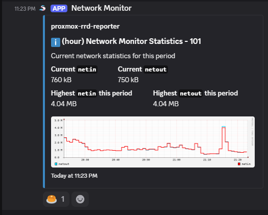

# proxmox-rrd-reporter

This wont be a very good readme. This fetches RRD data from a proxmox instance for a specifc VM id on a specific node, and saves it to disk and optionally sends to Discord. I may work on this more in the future to log and send more data like CPU or disk, but for now it's just for network monitoring.

Copy `.env.example` to `.env`, fill it out and reference optional params in [src/index.js#L27](src/index.js#L27)

Discord webhook example

## TODO

- [x] Sending in thread support
- [ ] Support for more than just one VM
- [ ] Threshold alerts
- [ ] Config file for multiple VMs and reporting configurations
